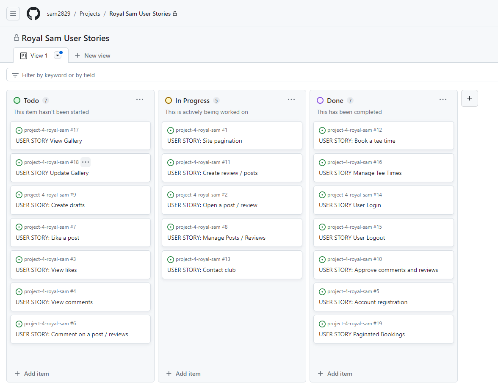

# Royal Sam Golf Club

## Overview

Royal Sam Golf Club is a site designed for a specific golf club so that the user is able to see about the golf club and book tee times to play. The user will be able to register or login, be able to search and book available tee times, be able to view, edit and delete any of the users bookings. The user will also be able to to leave reviews, comment and like on other reviews and also be able to view the the gallery and contact information.

Here is a live version of my project: [Royal Sam Golf Club](https://royal-sam-02fa0ed9cfe2.herokuapp.com/)

## Project Goals

This is my fourth portfolio project for the Code Institute and my goal with this project is to display my new skills in using frameworks such as Django and Bootstrap. I decided to build a site for a golf club which allows users to book and manage there tee times and also being able to leave reviews and comments about the golf club.

## Contents

- [Royal Sam Golf Club](#royal-sam-golf-club)
  - [Overview](#overview)
  - [Project Goals](#project-goals)
  - [Contents](#contents)
  - [User Experience](#user-experience)
    - [The Strategy Plane](#the-strategy-plane)
      - [The Ideal User](#the-ideal-user)
      - [Site Goals](#site-goals)
      - [First Time Visitor Goals](#first-time-visitor-goals)
      - [Returning Visitor Goals](#returning-visitor-goals)
    - [Agile Planning](#agile-planning)
  
  
## User Experience

### The Strategy Plane

Royal Sam Golf Club is intended to help golfers be able to book tee times to play at the golf course whether they are a member of a guest of the golf club. User will also be able to manage there bookings and be able to leave reviews and comment on other reviews.

#### The Ideal User

- Someone who enjoys playing golf.
- Someone who likes to play different golf courses.
- Someone who who is member of the Royal Sam Golf Club
- Someone who would like to share the experience of playing at the golf club.
- Someone who would like to book and manage all of their tee times online.

#### Site Goals

- To provide users with the ability to login or register an account to the site.
- To provide users with the ability to book and manager their tee times to play at the golf course.
- To provide users with the ability to review the golf club and view other reviews and leave comments and like.
- To provide users with images of the golf course.
- To provide the users with contact information.

#### First Time Visitor Goals

- To provide the user the ability to register an account.
- To stop user from being able to book tee times, leave reviews or commenting on reviews unless registering an account.
- To provide the user with images of the golf course.
- To provide user with contact information.
- To provide user the ability once registered to book and manage their tee times.
  
#### Returning Visitor Goals

- To provide user the ability to login to their account.
- To provide user the ability to logout of their account.
- To provide user the ability to to book and manage their tee times.
- To provide user the ability to leave their own review.
- To provide user the ability to leave comments and like other reviews.

### Agile Planning

This project was developed using agile methodologies by delivering small features across the duration of the project. This broke down the build of the project into alot more manageable parts and was able to select which user stories were more important for the site.

It was carried out this way to try ensure that all core requirements were completed first to give the project a complete feel and to make sure the most important user stories were implemented. When clicked on and opened the user story, the user story was assigned a label "must have", "should have" or "could have" so I would know the importance of the user story.

The kanban board was created using Github projects, this helped me be able to see all my user stories and be able to keep track of which ones had been done, to do or in progress.

