# Royal Sam Golf Club

## Overview

Royal Sam Golf Club is a site designed for a specific golf club so that the user is able to see about the golf club and book tee times to play. The user will be able to register or login, be able to search and book available tee times, be able to view, edit and delete any of the users bookings. The user will also be able to to leave reviews, comment and like on other reviews and also be able to view the the gallery and contact information.

Here is a live version of my project: [Royal Sam Golf Club](https://royal-sam-02fa0ed9cfe2.herokuapp.com/)

## Project Goals

This is my fourth portfolio project for the Code Institute and my goal with this project is to display my new skills in using frameworks such as Django and Bootstrap. I decided to build a site for a golf club which allows users to book and manage there tee times and also being able to leave reviews and comments about the golf club.

## Contents

- [Royal Sam Golf Club](#royal-sam-golf-club)
  - [Overview](#overview)
  - [Project Goals](#project-goals)
  - [Contents](#contents)
  - [User Experience](#user-experience)
    - [The Strategy Plane](#the-strategy-plane)
      - [The Ideal User](#the-ideal-user)
      - [Site Goals](#site-goals)
      - [First Time Visitor Goals](#first-time-visitor-goals)
      - [Returning Visitor Goals](#returning-visitor-goals)
    - [Agile Planning](#agile-planning)
      - [User Stories](#user-stories)
    - [The Skeleton Plane](#the-skeleton-plane)
      - [Wireframes](#wireframes)
      - [Database Schema](#database-schema)
      - [Security](#security)
    - [The Scope Plane](#the-scope-plane)
    - [The Structure Plane](#the-structure-plane)
      - [Features](#features)
  
## User Experience

### The Strategy Plane

Royal Sam Golf Club is intended to help golfers be able to book tee times to play at the golf course whether they are a member of a guest of the golf club. User will also be able to manage there bookings and be able to leave reviews and comment on other reviews.

#### The Ideal User

- Someone who enjoys playing golf.
- Someone who likes to play different golf courses.
- Someone who who is member of the Royal Sam Golf Club
- Someone who would like to share the experience of playing at the golf club.
- Someone who would like to book and manage all of their tee times online.

#### Site Goals

- To provide users with the ability to login or register an account to the site.
- To provide users with the ability to book and manager their tee times to play at the golf course.
- To provide users with the ability to review the golf club and view other reviews and leave comments and like.
- To provide users with images of the golf course.
- To provide the users with contact information.

#### First Time Visitor Goals

- To provide the user the ability to register an account.
- To stop user from being able to book tee times, leave reviews or commenting on reviews unless registering an account.
- To provide the user with images of the golf course.
- To provide user with contact information.
- To provide user the ability once registered to book and manage their tee times.
  
#### Returning Visitor Goals

- To provide user the ability to login to their account.
- To provide user the ability to logout of their account.
- To provide user the ability to to book and manage their tee times.
- To provide user the ability to leave their own review.
- To provide user the ability to leave comments and like other reviews.

### Agile Planning

This project was developed using agile methodologies by delivering small features across the duration of the project. This broke down the build of the project into alot more manageable parts and was able to select which user stories were more important for the site.

It was carried out this way to try ensure that all core requirements were completed first to give the project a complete feel and to make sure the most important user stories were implemented. When clicked on and opened the user story, the user story was assigned a label "must have", "should have" or "could have" so I would know the importance of the user story.

The kanban board was created using Github projects, this helped me be able to see all my user stories and be able to keep track of which ones had been done, to do or in progress.

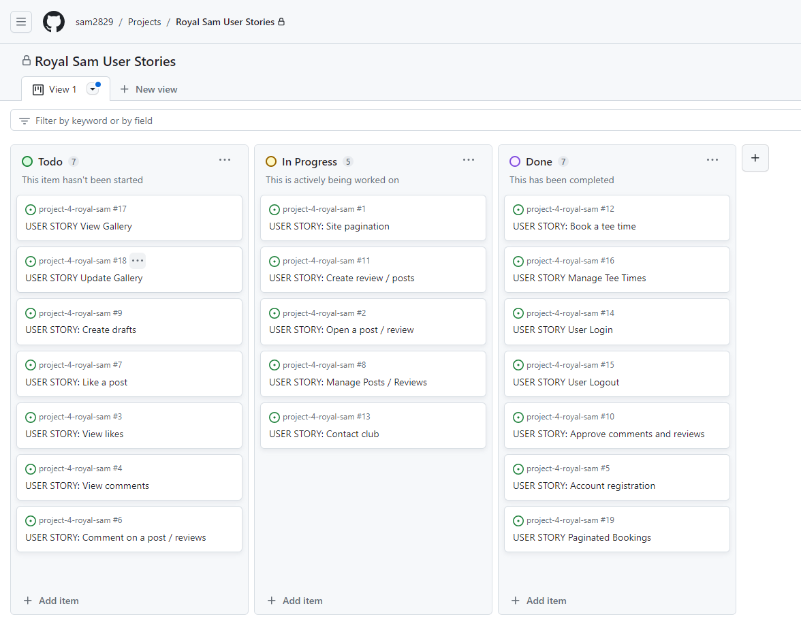

#### User Stories

The following user stories were completed throughout the development.

Account Registration:
  
- As a site user I can register an account so that I can book a tee time, create a post, comment or like.

User Login:

- As a site user I can login to my account so that I can manage my bookings, leave reviews or comment on posts / reviews.

User Logout:

- As a user I can logout of my account so that I can protect my bookings.

Book A Tee Time:

- As a site user I can book a tee time so that I can arrange to play golf the time I want.

Manage Tee Times:

- As a user / admin I can manage my bookings, edit and delete them so that I can easily change times to play golf.
  
Approve comments and reviews:

- As a site admin I can approve or disapprove comments and reviews so that I can filter out objectionable comments and reviews.

Contact Club:

- As a site user I can find contact information so that I can have any of my queries answered.

Create Review / Post:

- As a site user / admin I can create a post to update users or reply to reviews as admin and leave reviews as user so that I can leave my views and updates on the golf course.

Manage Reviews / Posts:

- As a admin I can create, read, update and delete posts / reviews so that iI can manage my content.

Like A Review / Post:

- As a site user I can like or unlike a post so that I can interact with the content.

Open A Review / Post:

- As a site user I can click on a post / review so that I can read the full text.

Site Pagination:

- As a site user I can view a paginated list of reviews so that I can easily select a review I want to view.

Update Gallery:

- As a admin I can create, update or delete the gallery photos so that the user can see updated photos of the golf course.

View Gallery:

- As a user I can view the course gallery so that I can see how good the golf course is.

Create Drafts:

- As a site admin I can create draft posts so that I can finish writing the content later.

Comment On A Post / Review:

- As a site user I can leave comments on a post / review so that I can be involved in the conversation.

View Comments:

- As a site user I can view comments on an individual post / review so that I can read the conversation.

View Likes:

- As a site user I can view the number of likes on each post / review so that I can see whichis the most popular or liked.

Paginated Bookings:

- As a user I can view a paginated list of my bookings so that I can clearly see the list of my bookings.

### The Skeleton Plane

#### Wireframes

Wireframes were used to create a prototype of the project which may change during its development.

Desktop

 

Homepage:

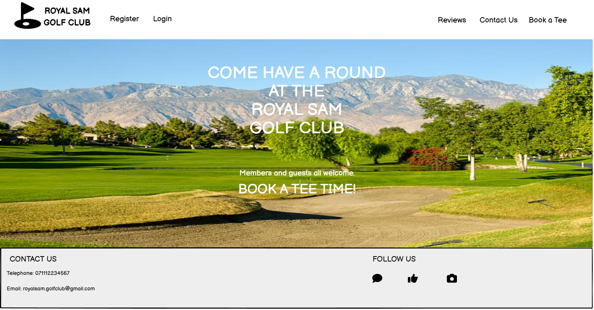

Register Page:

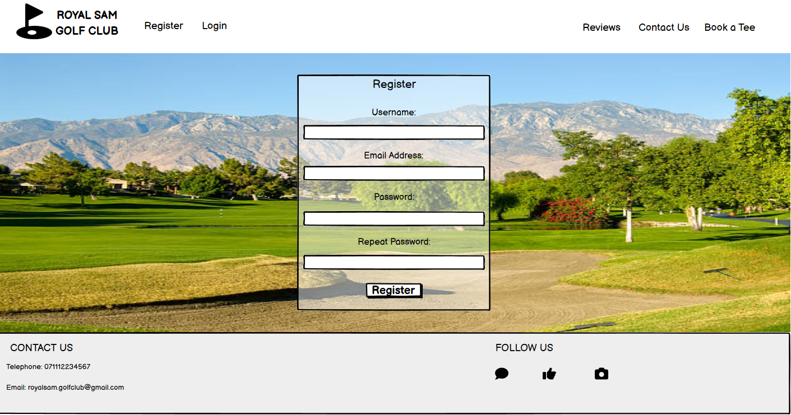

Login Page:

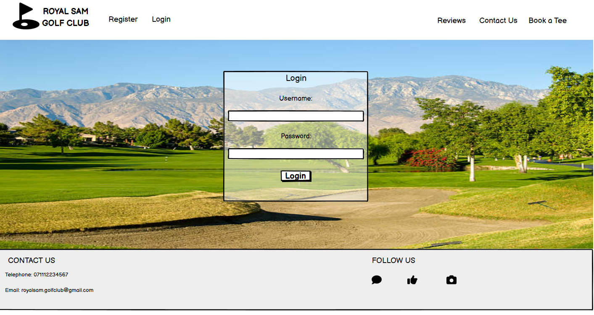

Reviews Page:

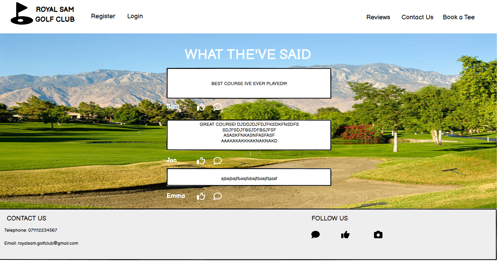

Mobile

 

Homepage:

Register Page:

Login Page:

Reviews Page:

#### Database Schema

The profile model is linked directly to the built in UserModel in conjunction with Django Allauth with the user progile being created when the user registers with the site. The Post (reviews) model has a relationship with the User model by foriegn key, this allows for the reviews left to be linked back to the specific user and their profile. The comment model is linked by foreign key to the Post model (reviews) to store comments for the specific review.

The Booking model is also linked directly to the built in UserMdodel so all bookings to be linked back to the specific user.

The GalleryIamge model was also created so that the site admin can upload images of the golf course when they please.

#### Security

In the code I have used if authenticated where needed so that users who are not logged in can not access or see information unless logged in.

Enviroment variables were stored in an env.py file for local development for security purposes to ensure that no secret keys, API keys, or any sensitive information was added to the repository. In production, these variables were also added to the Heroku config vars within the project.

### The Scope Plane

- Responsive Design - The site should be fully functional on all devices from 320px wide and up.
- Hamburger menu for navbar on mobile devices.
- Ability to perform CRUD functionality on Profiles, Reviews, Comments and Bookings.
- Restricted role-based features for leaving reviews and comments, booking and editing tee times.
- Homepage welcomeing user to the site and links to navigate through the site and options to login or register and account.
  
### The Structure Plane

#### Features

As a User I would like to view the site on all my different devices so I can view site where ever I am.

**Navbar**

As a user I want to see a clear way of navigating around the site so that I can easily find the relative information I am looking for.

The Navbar contains links for Home, My Account, Reviews About Us and Book A Tee options.

This is a list of the navigation options on all pages:

- Home -> index.html - Visible to all
- My Account (Dropdown):
  - Register -> signup.html - Visible to all logged out users
  - Login -> login.html - Visible to all logged out users
  - My Bookings -> my_bookings.html - Visible to all logged in users
  - Logout -> logout.html - Visible to all logged in users
- Reviews -> reviews.html - Visible to all users
- About Us (Dropdown):
  - Gallery -> gallery.html - Visible to all users
  - Contact Us -> contact_us.html - Visible to all users
- Book A Tee -> book_a_tee.html - Visible to all logged in users.

The navigation menu is displayed on all pages and forms into a hamburger menu on smaller devices. This allows users to view the site from any device and not take up to much space on mobile devices. Its very clear and easy to use.

Desktop:

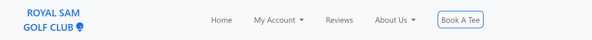

Mobile Device:

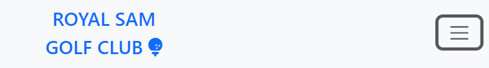
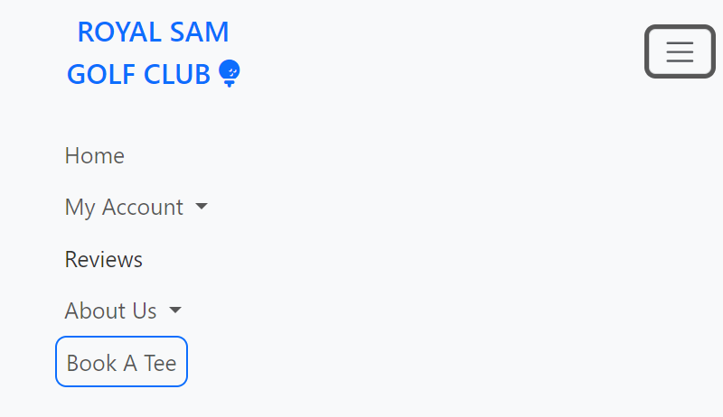

**Footer**

The footer is placed at the bottom of ever page. The social media links are displayed with icons provided by Font Awesome. This is where the user can click on one of the social media links and reach out for news and updates, these icons will also open up in new tabs as they will lead the user away from the site.

There is also contact information in the form of email address and telephone number.

Desktop:

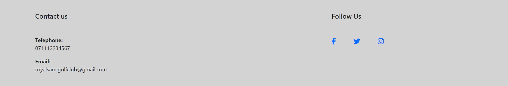

Mobile Devices:

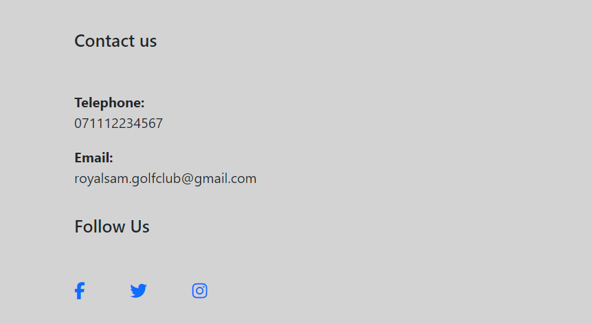

**Homepage**

Users will be presented by a welcoming message with a background image of the golf course on display. Book a Tee link will be displayed on the home page which depending whether user is logged in or not will be taken to book a tee time form or option for user to register or login.

**Register Page**

As a User if I havnt already made an online account I would like to be able to register an account using the register form from allauth, so I can then be able to take part in all the site has to offer.

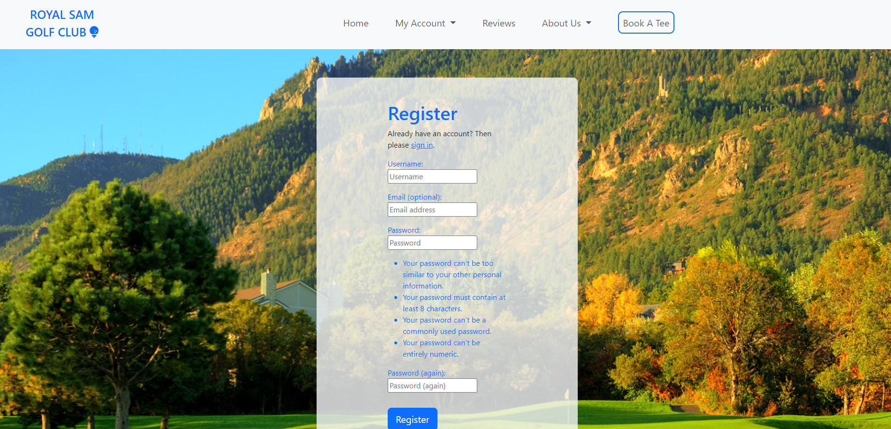

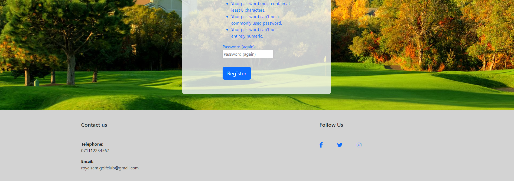

**Login Page**

As a User if I have already registered an account I would like to be able to log into my account when ever I wish, Whether it to be to book a tee time or leave a review. I would login by using the allauth login form.

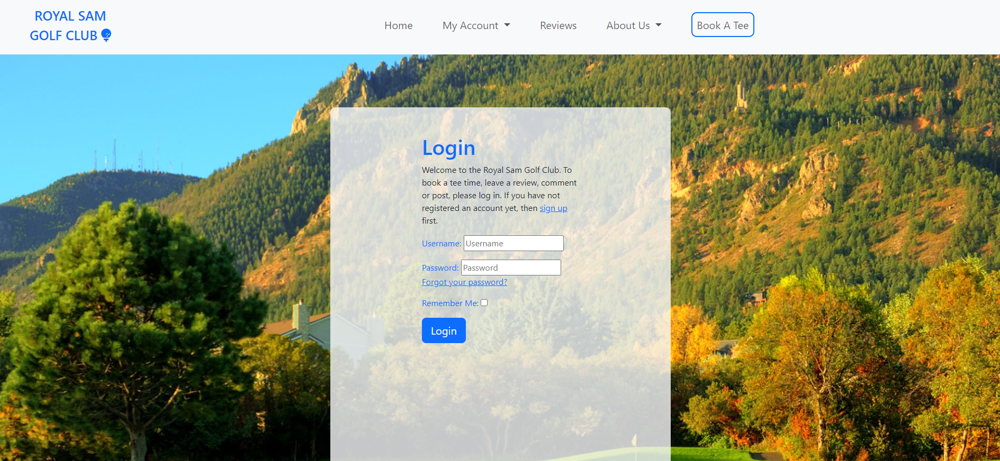

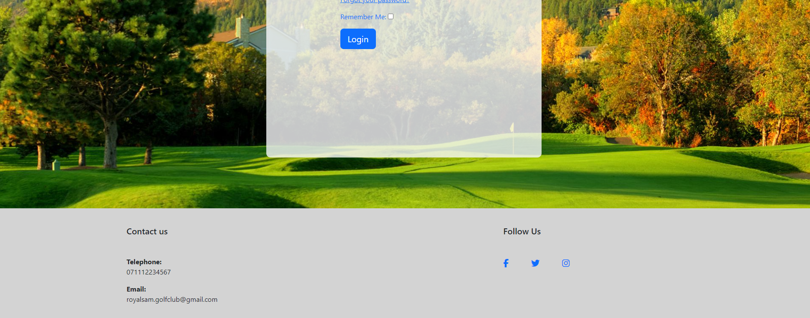

**Logout Page**

As a User if I am already logged in, I would like the ability to log out of my account and would like to be asked if I'm sure incase I was logging out by mistake. This will be done by the allauth templates.

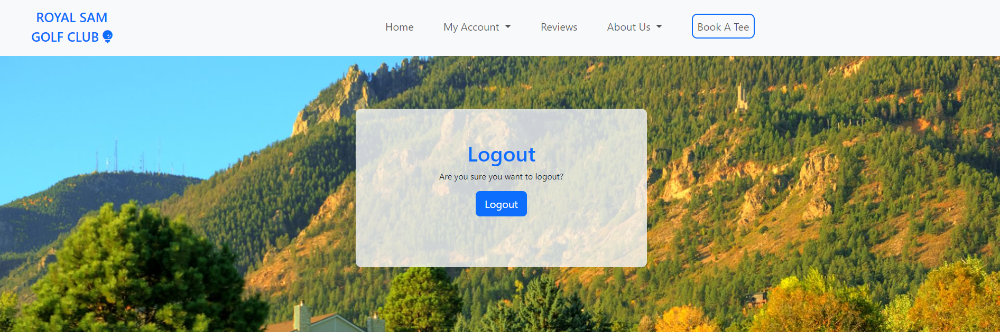

