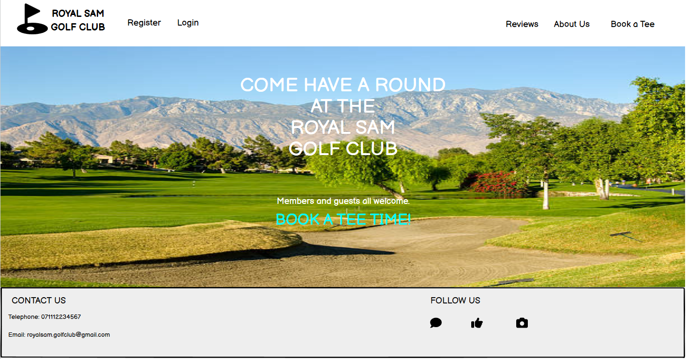
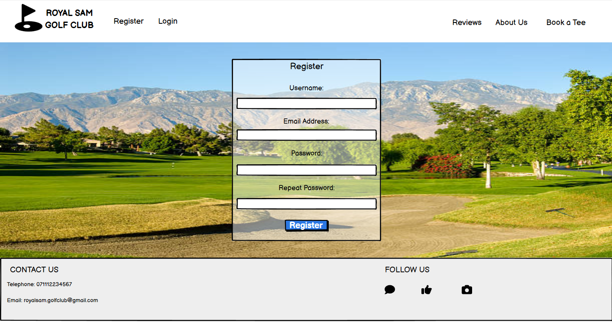
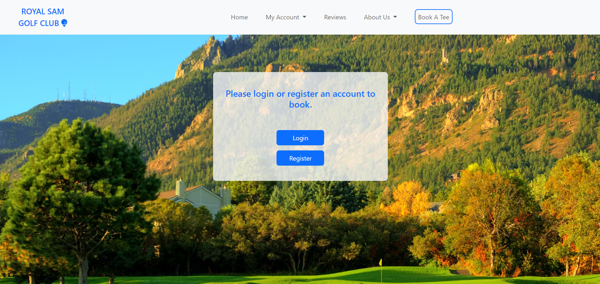
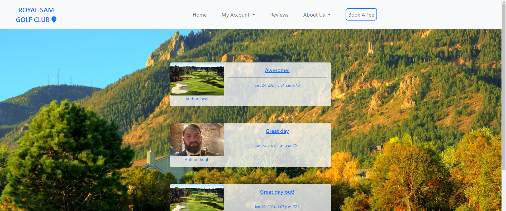

# Royal Sam Golf Club

## Overview

Royal Sam Golf Club is a site designed for a specific golf club so that the user is able to see about the golf club and book tee times to play. The user will be able to register or login, be able to search and book available tee times, be able to view, edit and delete any of the user's bookings. The user will also be able to leave reviews, comment and like on other reviews and also be able to view the gallery and contact information.

Here is a live version of my project: [Royal Sam Golf Club](https://royal-sam-02fa0ed9cfe2.herokuapp.com/)

## Project Goals

This is my fourth portfolio project for the Code Institute and my goal with this project is to display my new skills in using frameworks such as Django and Bootstrap. I decided to build a site for a golf club which allows users to book and manage their tee times and also being able to leave reviews and comments about the golf club.

## Contents

- [Royal Sam Golf Club](#royal-sam-golf-club)
  - [Overview](#overview)
  - [Project Goals](#project-goals)
  - [Contents](#contents)
  - [User Experience](#user-experience)
    - [The Strategy Plane](#the-strategy-plane)
      - [The Ideal User](#the-ideal-user)
      - [Site Goals](#site-goals)
      - [First Time Visitor Goals](#first-time-visitor-goals)
      - [Returning Visitor Goals](#returning-visitor-goals)
    - [Agile Planning](#agile-planning)
      - [User Stories](#user-stories)
    - [The Skeleton Plane](#the-skeleton-plane)
      - [Wireframes](#wireframes)
      - [Database Schema](#database-schema)
      - [Security](#security)
    - [The Scope Plane](#the-scope-plane)
    - [The Structure Plane](#the-structure-plane)
      - [Features](#features)
    - [The Surface Plane](#the-surface-plane)
      - [Design](#design)
  - [Technologies Used](#technologies-used)
    - [Languages Used](#languages-used)
    - [Frameworks and Tools Used](#frameworks-and-tools-used)
    - [Libraries Used](#libraries-used)
  - [Testing](#testing)
  - [Deployment](#deployment)
  - [Credits](#credits)
  
## User Experience

### The Strategy Plane

Royal Sam Golf Club is intended to help golfers be able to book tee times to play at the golf course whether they are a member of a guest of the golf club. User will also be able to manage their bookings and be able to leave reviews and comment on other reviews.

#### The Ideal User

- Someone who enjoys playing golf.
- Someone who likes to play different golf courses.
- Someone who is member of the Royal Sam Golf Club
- Someone who would like to share the experience of playing at the golf club.
- Someone who would like to book and manage all of their tee times online.

#### Site Goals

- To provide users with the ability to login or register an account to the site.
- To provide users with the ability to book and manager their tee times to play at the golf course.
- To provide users with the ability to review the golf club and view other reviews and leave comments and like.
- To provide users with images of the golf course.
- To provide the users with contact information.

#### First Time Visitor Goals

- To provide the user the ability to register an account.
- To stop user from being able to book tee times, leave reviews or commenting on reviews unless registering an account.
- To provide the user with images of the golf course.
- To provide user with contact information.
- To provide user the ability once registered to book and manage their tee times.
  
#### Returning Visitor Goals

- To provide user the ability to login to their account.
- To provide user the ability to logout of their account.
- To provide user the ability to book and manage their tee times.
- To provide user the ability to leave their own review.
- To provide user the ability to leave comments and like other reviews.

### Agile Planning

This project was developed using agile methodologies by delivering small features across the duration of the project. This broke down the build of the project into a lot more manageable parts and was able to select which user stories were more important for the site.

It was carried out this way to try ensuring that all core requirements were completed first to give the project a complete feel and to make sure the most important user stories were implemented. When clicked on and opened the user story, the user story was assigned a label "must have", "should have" or "could have" so I would know the importance of the user story.

The kanban board was created using Github projects, this helped me be able to see all my user stories and be able to keep track of which ones had been done, to do or in progress.

#### User Stories

The following user stories were completed throughout the development.

Account Registration:
  
- As a site user I can register an account so that I can book a tee time, create a post, comment or like.

User Login:

- As a site user I can login to my account so that I can manage my bookings, leave reviews or comment on posts / reviews.

User Logout:

- As a user I can logout of my account so that I can protect my bookings.

Book A Tee Time:

- As a site user I can book a tee time so that I can arrange to play golf the time I want.

Manage Tee Times:

- As a user / admin I can manage my bookings, edit and delete them so that I can easily change times to play golf.
  
Approve comments and reviews:

- As a site admin I can approve or disapprove comments and reviews so that I can filter out objectionable comments and reviews.

Contact Club:

- As a site user I can find contact information so that I can have any of my queries answered.

Create Review / Post:

- As a site user / admin I can create a post to update users or reply to reviews as admin and leave reviews as user so that I can leave my views and updates on the golf course.

Manage Reviews / Posts:

- As a site admin I can create, read, update and delete posts / reviews so that I can manage my content.

Like A Review / Post:

- As a site user I can like or unlike a post so that I can interact with the content.

Open A Review / Post:

- As a site user I can click on a post / review so that I can read the full text.

Site Pagination:

- As a site user I can view a paginated list of reviews so that I can easily select a review I want to view.

Update Gallery:

- As a site admin I can create, update or delete the gallery photos so that the user can see updated photos of the golf course.

View Gallery:

- As a user I can view the course gallery so that I can see how good the golf course is.

Comment On a Post / Review:

- As a site user I can leave comments on a post / review so that I can be involved in the conversation.

View Comments:

- As a site user I can view comments on an individual post / review so that I can read the conversation.

View Likes:

- As a site user I can view the number of likes on each post / review so that I can see which is the most popular or liked.

Paginated Bookings:

- As a user I can view a paginated list of my bookings so that I can clearly see the list of my bookings.

[Back to top](#royal-sam-golf-club)

### The Skeleton Plane

#### Wireframes

Wireframes were used to create a prototype of the project which may change during its development.

Desktop

 

Homepage:

Register Page:

Login Page:

Reviews Page:

Mobile

 

Homepage:

Register Page:

Login Page:

Reviews Page:

#### Database Schema

The profile model is linked directly to the built in User Model in conjunction with Django Allauth with the user profile being created when the user registers with the site. The Post (reviews) model has a relationship with the User model by foreign key, this allows for the reviews left to be linked back to the specific user and their profile. The comment model is linked by foreign key to the Post model (reviews) to store comments for the specific review.

The Booking model is also linked directly to the built in User Model so all bookings to be linked back to the specific user.

The Gallery Image model was also created so that the site admin can upload images of the golf course when they please.

#### Security

In the code I have used if authenticated where needed so that users who are not logged in cannnot access or see information unless logged in.

Environment variables were stored in an env.py file for local development for security purposes to ensure that no secret keys, API keys, or any sensitive information was added to the repository. In production, these variables were also added to the Heroku config vars within the project.

### The Scope Plane

- Responsive Design - The site should be fully functional on all devices from 320px wide and up.
- Hamburger menu for navbar on mobile devices.
- Ability to perform CRUD functionality on Profiles, Reviews, Comments and Bookings.
- Restricted role-based features for leaving reviews and comments, booking and editing tee times.
- Homepage welcoming user to the site and links to navigate through the site and options to login or register and account.

[Back to top](#royal-sam-golf-club)
  
### The Structure Plane

#### Features

As a User I would like to view the site on all my different devices so I can view site wherever I am.

**Navbar**

As a user I want to see a clear way of navigating around the site so that I can easily find the relative information I am looking for.

The Navbar contains links for Home, My Account, Reviews About Us and Book A Tee options.

This is a list of the navigation options on all pages:

- Home -> index.html - Visible to all
- My Account (Dropdown):
  - Register -> signup.html - Visible to all logged out users.
  - Login -> login.html - Visible to all logged out users.
  - My Bookings -> my_bookings.html - Visible to all logged in users.
  - Logout -> logout.html - Visible to all logged in users.
- Reviews -> reviews.html - Visible to all users.
- About Us (Dropdown):
  - Gallery -> gallery.html - Visible to all users.
  - Contact Us -> contact_us.html - Visible to all users.
- Book A Tee -> book_a_tee.html - Visible to all logged in users.

The navigation menu is displayed on all pages and forms into a hamburger menu on smaller devices. This allows users to view the site from any device and not take up too much space on mobile devices. It's very clear and easy to use.

Desktop:

Mobile Device:

**Footer**

The footer is placed at the bottom of ever page. The social media links are displayed with icons provided by Font Awesome. This is where the user can click on one of the social media links and reach out for news and updates, these icons will also open up in new tabs as they will lead the user away from the site.

There is also contact information in the form of email address and telephone number.

Desktop:

Mobile Devices:

**Homepage**

Users will be presented by a welcoming message with a background image of the golf course on display. Book a Tee link will be displayed on the home page which depending on whether user is logged in or not will be taken to book a tee time form or option for user to register or login.

**Register Page**

As a User if I havn't already made an online account, I would like to be able to register an account using the register form from Allauth, so I can then be able to take part in all the site has to offer.

**Login Page**

As a User if I have already registered an account, I would like to be able to log into my account when ever I wish, whether it to be to book a tee time or leave a review. I would login by using the allauth login form.

**Logout Page**

As a User if I am already logged in, I would like the ability to log out of my account and would like to be asked if I'm sure in case I was logging out by mistake. This will be done by the Allauth templates.

**Book A Tee Page**

As a User if I click on the book a tee page, what page is rendered depends on if the user is logged in or logged out.

If the user is logged out a page will be rendered offering the user chance to either login or register account, providing links to each option.

If the user is logged in, the user is taken to the first part of the booking form where the user provides email address and selects the date they wish to book. Both fields must be filled out correctly. The date selected must also have available times and be the present or future date.

Once the user has filled out the first part of the form correctly, the user will then be asked to fill out the second part of the form where they can easily select which time they would like out of the available times shown, how many players, if they are a member of the golf club and if they require a buggy.

Available times shown will only be times that havn't already been booked and times that havn't already passed.

Number of players can only be between numbers 1 and 4.

All fields must be filled out before user can book their time.

Once User has successfully booked, they will be redirected to the main my bookings page.

**My Bookings Page**

As a User the my bookings page is only available once the user has logged in.

If the user has any current bookings this will be displayed in order of their next tee time. Three bookings will be displayed per page and user can click next or previous to paginate through the pages to see all their bookings.

The User will also be able to edit or delete any of their bookings from this page.

If the user has no current bookings, a message will be displayed informing them they have no bookings and option to then book a tee.

**Reviews Page**

As a User you can go onto the reviews page and be able to see all reviews left about the golf club and also be able to see any posts the golf club may have made.

User will also be able to paginate through the reviews from page to page.

All reviews and posts will be displayed in most recent order.

User will also be able to click on any review they like to then view the review in full.

If the user hasn't logged in, they are not able to leave a review of their own:

If the user is logged in, they able to leave a review of their own by clicking on the Leave A Review link at the bottom of the page:

**Leave A Review Page**

If the User is logged in, they have the option to leave their own review.
To do this they click on the leave review link on the reviews page, they then must fill out the Leave A Review form.

On the form the title and content section must be filled out to be able to submit the form. If the user has not selected an image for their review, then the sites custom image will be applied to the review.

Once submitted a pop-up message will confirm user has submitted a review and is awaiting approval and redirected back to reviews page.

**Full Review Page**

If the user clicks on a review and are not logged in, they are able to view the review in full, what comments have been made and how many comments there are.

Desktop:

Mobile:

If the user is logged in, they are also able to like the review and leave a comment in the comment form which is now available.

desktop:

Mobile:

If the user decides to comment on the review both fields must be filled out correctly on the leave a comment form.

Once the user has submitted the form, they will be notified that their comment is awaiting approval.

desktop:

Mobile:

**Gallery Page**

As a user I can go onto the gallery page and view photos of the golf course.

Images can be uploaded and deleted by the site administrator.

Desktop:

Mobile:

**Contact Us Page**

As a User I can view the Contact Us page and be able to see contact information as a telephone number and email address, I can also click on social links to follow the golf club and also able to view the location of the golf club from google maps.

Desktop:

Mobile:

**Error Page 404**

I implemented and styled a 404 error page that can alert users when they have accessed a page that doesn't exist or a broken link.

The error 404 page will allow the user to easily navigate back to the home page of the site.

**Error Page 500**

I implememnted and styled a 500 error page that can alert users when an internal server error has occured.

The error 500 page will allow the user to easily navigate back to the home page of the site.

[Back to top](#royal-sam-golf-club)

### The Surface Plane

#### Design

**Colour Scheme**

I opted for a very few choices of colours throughout the site. The same colours have been implemented across the site and are included in the button's styles.

This hopefully makes the site easy and clear to read / use.

**Imagery**

Background images and gallery page images were taken from google images.

Font awesome was used for social links and for golf ball on a tee icon in the page title.

## Technologies Used

### Languages Used

- HTML5
- CSS
- JavaScript
- Python

### Frameworks and Tools Used

- Django
  - Django was used as the main python framework in the development of this project.
- Bootstrap
  - Bootstrap was used for the general layout, spacing and style for the website.
- ElephantSQL
  - ElephantSQL was used for the production database.
- Cloudinary
  - Cloudinary was used to store static files and images.
- Codeanywhere
  - Codeanywhere was used to write the code for the site.
- GitHub
  - GitHub was used to store the projects code after being pushed from codeanywhere.
- Heroku
  - Heroku was used to deploy the app.
- Balsamiq
  - Balsamiq was used to create my wireframes.
- Google Maps
  - Google Maps was used from my google account to show google maps on site.

### Libraries Used

[Back to top](#royal-sam-golf-club)

## Testing

I have included details of my testing during and post development in a separate file called [TESTING.md](TESTING.md)

[Back to top](#royal-sam-golf-club)

## Deployment

**GitHub**

This project was developed by using a specialized code institute template which is set up to run in Codeanywhere.

* Once loaded the template provided by code institute, in the top right of the file click on the green drop-down menu labelled "code".
* Then select HTTPS.
* Next copy the URL given to you.
* Next, I loaded up the Codeanywhere and clicked on "new workspace" at the top of the page.
* In the repository URL, paste in the URL copied from the GitHub account.
* Next click on create and the bottom right of the page.

**Version Control**

For version control the following steps were made:

* If any changes were made to my Codeanywhere project.
* First files were made ready for commit with command - git add filename or git add . to add all files.
* To commit the changes using the following command - git commit -m "This is my commit" Note the brief description at the end of the command to make you aware of what changes have occurred.
* To then move the changes to GitHub, use the following command - git push

**Deployment to Heroku**

For deployment to Heroku the following steps were made:

- First sign in to your Heroku account.
  - On the top right of the page there is a drop-down menu called "new", click this and click on "create new app".
  - You then need to decide your unique app name using '-' between each word. Then select which region you are working from and then click on the button "create app".
  - Once you have clicked on "create app" you will be taken to a new page. On this page you will see a row of tabs at the top left of the page. You first need to click on the "settings" tab and go to the settings page.
  - If you have any code that you have kept private which has been prevented from loading to your GitHub, then you must click on the button "Reveal Config Vars". A small table will then appear with columns "key" and "value". Config Vars used:
    - CLOUDINARY_URL: (Enter Cloudinary API URL)
    - DATABASE URL: (Enter the database URL from ElephantSQL)
    - DISABLE_COLLECTSTATIC:
    - SECRET_KEY: (Enter your secret key)
    - PORT: 8000
    - GOOGLE_API_KEY: (Enter your google account API key for google maps)
  - I then had to add a buildpack. To do this I clicked on the "Add Buildpack" button, a pop-up window then appears and I then have to click on "python" then the button "Add Buildpack".
  - I then had to repeat this process but this time adding the "node.js" buildpack. It is important to make sure these buildpacks are added in this order.
  - I then went back to the tabs row at the top of the page and clicked on the "Deploy" tab to take me to the deploy page.
  - On the deployment page, I scrolled down to deployment method and confirmed I wanted to deploy through GitHub.
  - When I click on GitHub a search bar will appear underneath which will allow me to search for my GitHub repository. I made sure I spelt the repository I'm searching for exactly as I named it and then clicked the search button.
  - The repository then appeared underneath my search, I checked this was the correct repository and then clicked the "connect" button. This has now linked up my Heroku app and my GitHub repository code.
  - I then scrolled down and clicked on the button "Enable Automatic Deploys", this allows my Heroku app to automatically update every time I've pushed a new change to my code to GitHub.
  - I then scrolled down and clicked on the button "Deploy Branch" which is now building the app.
  - Once the app is successfully deployed, a message appeared saying "your app was successfully deployed." Then click on the "view" button which will take me to the deployed link.

[Back to top](#royal-sam-golf-club)

## Credits

* Code Institute - Provided the template and Codeanywhere so that I was able to build this project. Also, without the knowledge gained through out doing the course I would not have been able to build this project. The tutor support was also very helpful.
* Slack - The slack community help me search for any issues I came across and build this project.
* Django - For being able to use Django to build my project and all the documentation to help build and set up correctly.
* Allauth - For being able to use their templates.
* Google - For use of all images in the project.
* YouTube - For extra learning material to try and understand more about Django.
* Mentor Jubril - For helping me realise what's needed to build a good project and also for encouragement and understanding.

[Back to top](#royal-sam-golf-club)
