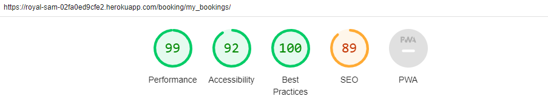
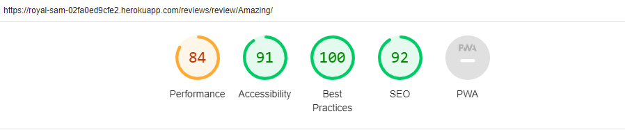
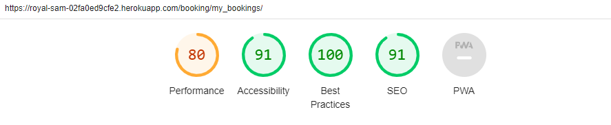

# Royal Sam Golf Club Testing

## Testing Overview

During the development of this project, numerous testing was carried out by myself and others.

## Contents

- [Royal Sam Golf Club Testing](#royal-sam-golf-club-testing)
  - [Testing Overview](#testing-overview)
  - [Contents](#contents)
  - [Manual Testing](#manual-testing)
  - [Validators](#validators)
    - [Lighthouse](#lighthouse)
    - [CI Python Linter](#ci-python-linter)
    - [W3C CSS Validator](#w3c-css-validator)
    - [W3C Markup Validator](#w3c-markup-validator)
  - [Responsiveness](#responsiveness)

## Manual Testing

Manual testing was carried out throughout the project, making sure user stories were working successfully and the site was functioning correctly.

Full test table:

| Feature | Expected Outcome | Testing Performed | Result | Pass / Fail |
| --- | --- | --- | --- | --- |
| When user first loads site. | When the page is first loaded, the user is presented with a clear, welcoming homepage. | Loaded the site. | The home page was loaded, with clear welcoming message and aware of what the site is. | Pass |
| Title and logo links to homepage. | When I click on the sites title and logo, this will redirect me to the site's homepage. | When on the site I clicked on the title / logo from different pages on the site. | Every time I clicked on the title / logo I was redirected to the homepage. | Pass |
| Links in navbar working correctly. | When user clicks on any of the links in the navbar, the user is taking to the correct page for that link. | When on the site I clicked on all the links whilst on different pages of the site to see if links worked and took me to correct page. | All links worked and took me to correct page. | Pass |
| Links to social media in footer. | When user clicks on one of the social media links in the footer, the correct social media will open up in a new tab. | When on the site I clicked on all social media links numerous times. | Every time I clicked on the social media icons, the correct website loaded up in a new tab. | Pass |
| Book A Tee not logged in. | When user is not logged in and clicks on the any of the book a tee links, they are taken to a page with a message asking them to login or register an account. Links to login and register are both provided in message. | Clicked on all book a tee links when not logged in. | Taken to page with message asking user to login or register to book and provide links to do so. Links also take user to the respected pages. | Pass |
| Register account | When user clicks on any of the register links, they are redirected to the register page and a register form appears. User must fill out required fields and correctly to successfully create an account. | Went onto the register page and numerous times attempted to fill out form incorrectly. | Registered numerous accounts and every time must fill out the form correctly which is clearly stated to create account. | Pass |
| Once registered redirected back to home page. | Once user has registered an account successfully, they are redirected to the home page. | Registered numerous accounts. | Every time I was redirected to homepage. | Pass |
| Registered pop-up message. | When a user has successfully registered an account a pop-up message will appear, welcoming them to the site and displaying who they have logged in as. | Registered several different accounts. | Every time successfully registered a pop-up message appeared displaying who I have logged in as and welcoming me to the site. | Pass |
| Login to account | User is able to log into their existing account by typing in their existing username and password in the login form on the login page. | Went onto login page and attempted to log in to several different accounts previously created by the login form. | If form filled out correctly, successfully logged into user's account. | Pass |
| Login pop-up message. | When a user logs in successfully a pop-up message appears showing the users name and welcoming them to the site. | Logged in as several different users. | Every time I logged in a pop-up message appeared welcoming me to the site with the user's name. | Pass |
| navbar changed when user logged in. | When a user has logged in, My Account drop down menu in navbar changes to now read my bookings and logout. These links also work and take you to the correct pages. | Logged in to several different accounts numerous times. | Every time logged in the navbar changed and links worked correctly. | Pass |
| Logout | When user is logged in, they are able to click on the logout link, this takes them to a logout page which asks the user if they are sure they want to logout. Clicking on the logout in the message will logout the user. | Went through the logging out process using several different accounts. | Successfully logged out of accounts and navbar turns back into original (logged out) state. | Pass |
| Logout pop-up message. | When a user has logged out a pop-up message appears informing them, they have logged out successfully. | Logged out with several different accounts. | Every time logged out successfully a pop-up message appeared informing me that I had done so. | Pass |
| Reviews page logged out. | User is able to go onto the reviews page when logged out. A list of all reviews should be on display and user should also be able to paginate through the reviews. | Numerous times visited site without being logged in and went on the reviews page. | All reviews were displayed in a list and was able to paginate through the reviews. | Pass |
| Reviews page logged in. | User is able to go onto the reviews page just like when logged out but now has a link option to leave their own review. This link takes them to the leave a review page and form. | Logged into several different accounts and went on to the reviews page. | Every time reviews were displayed as they should be a leave a review link is now present. The link successfully takes me to the leave a review page and form. | Pass |
| Leave a review. | When user goes to leave a review, they must fill out the form correctly before submitting. Once form is filled out correctly and submitted user is redirected back to the reviews page and informed with pop up message the review is awaiting approval. | As a user attempted to leave many reviews and tried submitting form incorrectly. | Form had to be filled out correctly. Once done correctly I was redirected to the main reviews page and had pop up message saying my review is awaiting approval. | Pass |
| logged out review in full. | When user is logged out and on the reviews page, they are able to click on any review they choose and be able to open that review in full and see all its details, including any comments. | Went on the review page and tried clicking on all reviews. | Every time I was taken to the review I clicked on, the review was now displayed in full on its own, with any comments also on display. | Pass |
| Logged in review in full. | When user is logged in, they can open a review up in full the same as when logged out, but now they are able to like the review themselves and also able to leave a comment of the own by filling out the comment form which is now visible. | Logged into several different account  and opened up several different reviews. | Every time reviews opened up in full. I was able to like and unlike the review by clicking on the heart icon. The comment form was also now visible to allow me to leave my own comment. | Pass |
| Leave a review comment. | When user is on the full review page and logged in, they are able to leave a comment only if comment form is filled out correctly. | Logged in several different accounts and tried commenting on several different reviews. | Every time the comment form had to be filled out correctly and only then would it submit. | Pass |
| Comment approval message. | When successfully submitted the comment form, a message appears where the form was stating my comment is now awaiting approval. | Tried submitting numerous comments. | Every time once form was filled out correctly the form was replaced with a message stating my comment is awaiting approval. | Pass |
| Comment icon count. | When viewing the review in full the comments icon displays the number of how many comments this review has. | Clicked on several reviews to see if the comments icon was displaying the number of comments. Also then created new comments to make sure the number was adding up. | The comments icon was displaying the correct number of comments and was also adding up once a comment had been approved. | Pass |
| Number of likes | When on the main reviews page, the review information on display would show how many likes this review has had. | Went on the main reviews page to see the list of all reviews to see if they displayed how many likes the review has had. I then went onto each review in full and liked them. | Every time I went onto the main reviews page, I could see how many likes each review has had, then when I went back on the main reviews page after liking individual reviews, I could see the number of likes had gone up. | Pass |
| Google maps. | When user loads the Contact Us page, google maps loads and is displayed. | As a user loaded up the Contact Us page. | Contact Us page loads and google maps is on display. | Pass |
| Book a tee. | When user is logged in and clicks on any book a tee links, the user is taken to the first part of the booking process. User must fill out he book a tee form correctly before being able to continue to the next part. | Logged in to several different accounts and clicked on the book a tee links. Tried leaving fields blank in the book a tee form. | Every time the book a tee form loaded correctly and user was not allowed to continue to the second part unless both fields were filled out correctly. | Pass |
| Book a tee form correct date. | When user is selecting a date for the book a tee form, the user must select a date that either the present date or future date. Any past date submitted will make a pop-up message appear asking the user to select a future date. | Loaded the book a tee form and tried submitting a past date. | User was unable to move on to the next part of the booking and pop-up message appears asking user to select a future date. | Pass |
| Book a tee form available date. | When user is selecting a date for the book a tee form, the user must select a date that has available times. Once date is selected and next button clicked, if there are no available times for that date user will have to select a different date to progress with booking and pop-up message appears informing user there is no available times for that date. | Several times filled out the book a tee form with a date which I knew was fully booked or was too late at night. | Every time I was not allowed to progress to the next part of the booking and pop-up message appeared informing me there were no times available. | Pass |
| Booking date default. | When booking form first loads, the dates default is always the present date. | Loaded up the booking form on teveral different days. | The date always defaults to the present date. | Pass |
| Booking form 2 | Once user has successfully submitted the first part of them form with the date and email, they are forwarded onto to the second part of the form. The form loads and a pop-up message appears letting the user know what date they selected in the previous form. | Submitted the first part of the booking forms successfully. | The second part of the booking loaded correctly pop-up message appeared letting me know the date I selected in the previous form. | Pass |
| Booking under name. | When user is booking a tee time, in both forms it will inform the user the name of the user they are booking under. | Logged into several different accounts and went through both booking forms. | Every time both forms displayed the correct name of the user account I was booking under. | Pass |
| Booking tee time | When user clicks on booking time, a drop down menu of all the available tee times will appear. If a tee time has already been booked this tee time will not be displayed. | I went to the booking time for dates I knew didn't have any bookings and then the same for dates where I knew had times already taken. | For the dates I knew hadn't had any bookings the full list of times were displayed and for dates I knew had already had times booked, this only displayed the available times. | Pass |
| Booking time default. | When the booking form for time loads, the time always defaults to the earliest time available that day. | Loaded the booking form at different times of day and days when I knew there were many bookings. | The bookings time always defaulted to the next available time. | Pass |
| Number of players. | When user is on the second part of the booking form, the number of players option is a drop down-menu and will only let users select number 1 to 4. This option is also default to 1. | Logged in as several different users and went through booking process and tried selecting number of players. | When trying to select number of players, form provides a drop-down menu which only lets users select number 1 - 4. When form is originally loaded its default was always 1. | Pass |
| Booking member | When user is filling out the booking form, they are able to select and tick the box to confirm they are a member of the golf club. | Loaded the booking form and tried selecting the member field. | I was able to select the member field. | Pass |
| Booking buggy. | When user is filling out the booking form, they are able to select whether or not they would like to have a buggy. | Loaded the booking form and tried selecting the buggy field. | I was able to select the buggy field. | Pass |
| Successfully booked. | When user has successfully booked a tee time, they are redirected to the my bookings page where there booking should now be. A pop-up message will also appear showing information for the recent booking. | Logged in as several different users and created bookings. | Every time I created a booking, I was redirected to the my bookings page where I could see my bookings and a pop-up message appeared with information from my recent booking. | Pass |
| My bookings page. | When User clicks on my bookings link, my bookings page loads displaying all clearly the bookings the user has made in order of their next booking. Bookings that havn't already past will be shown. | Logged in with many different users and loaded the my bookings page. | Every time I loaded the my bookings page, any bookings the user has made and that has not past were displayed clearly in a list, in order of the next booking. | Pass |
| My booking page with no bookings. | When user loads the my bookings page and they have no upcoming bookings, a message on the screen will inform them they have no bookings with a link to book a tee. This link will take user to the first part of the book a tee form. | Logged in as several users with no bookings and loaded the my bookings page. | My bookings page loaded which then stated I had no bookings and shown me a link to book a tee. The book a tee link successfully took me to the first part of the book a tee form as other book a tee links. | Pass |
| Paginate though my bookings. | When user loads up the my bookings page, if they have more than three bookings the user is able to paginate through different pages to view their bookings. | Logged into several different accounts that had lots of bookings and loaded the my bookings page. | I was able to paginate through pages to view all of my bookings. | Pass |
| My bookings edit. | When user is in my bookings page, they are able to click on the edit button on any booking which will then take them to the first part of the booking forms. This time the form reads change tee time and has a cancel button present. | Logged in as several different users and tried the edit button on several different bookings. | Every time I clicked on the edit button, I was taken to the first part of the booking form, it was named change tee time and had a cancel button present. | Pass |
| My bookings edit forms. | User is able to edit bookings by going through the booking process as user would do normally to make a booking. Difference is both booking forms are now titles change tee time and have cancel buttons and final submit button reads update. | Went through the editing booking process. | I was able to select booking options just as usual booking process. Forms were now titled change tee time and cancel buttons were now present. Update was now the final form submit button. | Pass |
| My bookings cancel button. | When user is in the editing a booking process, if in either of the forms the user clicks the cancel button, the editing process will be cancelled and redirected back to the main my bookings page. | Went through editing process and at separate occasions clicked on cancel in both forms. | Every time in either form the editing process was cancelled and was redirected back to main bookings page. | Pass |
| Edit booking date. | When user tries to edit a booking, on the first form the default for the date field will now be the date of the booking the user is trying to edit. | Tried editing bookings with different dates. | Every time I clicked on edit, the existing date of the booking I was editing was already present in the date field. | Pass |
| Edit booking email. | When user tries to edit a booking, on the first form the email field will already be filled in with the email from the existing booking. | Tried editing bookings with different emails. | Every time I clicked on edit on different users with different email addresses, the existing email address from that booking was already in the email field. | Pass |
| Edit booking successful. | When user is trying to edit a booking and has gone through the process just like the original booking process. The user clicks update to submit, the user is then redirected back to the main my bookings page where they can find the booking they had edited will now show will the new information for the booking. Pop up message will also appear with information about the recent booking. | Went through the editing process for numerous bookings. | Every time I was redirected back to the main my bookings page where I could see the changes I had just made, and a pop-up message appeared showing me the recent booking information. | Pass |
| Delete Booking. | When a user is on the my booking  page, they are able to click on delete on any of their bookings, which will take them to a page asking if they are sure they want to delete this booking. If they click yes, the booking will be deleted and redirected back to the main my bookings page, an alert message will also appear telling the user they have successfully deleted their booking. If they click no, they will be redirected back to the main my bookings page. | Logged into several different accounts and deleted several different bookings. Also clicked no to delete on several different bookings. | When I clicked on the delete button for any booking, I was taken to a separate page asking if I'm sure I want to delete. When I clicked yes, I was redirected back to the main my bookings page and the booking was deleted, the alert message was also on display. When I clicked on no I was redirected back to the main my bookings page and the booking was still present. | Pass |
| All forms cannot accept only spaces. | When a user is filling out any of the forms, the user is not able to just use only spaces in any of the required fields and submit the form. | In the leave a review form and comments form, for all required fields I attempted to submit the forms with only spaces. I did this all together and fields individually to prove if it worked. | Everytime I tried to submit a form with any of the required fields only having spaces, the form was not submitted and the page was reloaded with a alert messaged saying "Something went wrong, please try again. Note fields should not contain only spaces.". | Pass |
| Alert messages timeout. | Once an alert message is displayed it can either be closed by the user or timed out in four seconds. | Went through various scenarios where alert messages would be displayed. I then attempted to close them and see if they would time out. | Every time an alert message appeared I was able to close down the message myself or if I waited four seconds the message would time out. | Pass |
| Admin user login. | The admin is able to login to the admin user page with the username and password I had set up. | Tried logging in to the admin page. | Was able to log in to the admin page. | Pass |
| Admin page styling. | When admin is logged in the admin page should be styled with Summernote as planned. | Logged in as admin. | The admin page was styled as planned. | Pass |
| Admin approve post / reviews. | When the admin is logged in, they are able to see the posts awaiting approval and can approve the posts so they will then be displayed. | As a user created many reviews, then logged into the admin page. | When logged in as admin I could see the reviews waiting to be approved and was able to approve them. Recently approved reviews were then on display in the reviews page. | Pass |
| Admin search posts and display. | Admin is logged in and on the post section. The posts are displayed in order and information is set up as in code. Admin can also search for posts by selected fields in code. | Logged in as admin and viewed post page. Then tried searching for individual posts by certain fields. | Posts were displayed in order I set, and I was able to search and find posts by certain fields. | Pass |
| Admin delete posts | Admin is able to delete any post they wish, when post is deleted all the comments with that post is also deleted. | Logged in as admin and deleted posts. | The posts were deleted along with all the comments with it. | Passy |
| Admin approve comments. | When the admin is logged in, they are able to see the comments awaiting approval, they can then approve these comments so they will be displayed. | As a user created many comments on different reviews. Then logged in as admin. | When logged in as admin and onto the comments page, I could see the comments waiting approval and was able to approve them. The recently approved comments were then visible on the relevant reviews / posts. | Pass |
| Admin search comments. | Admin is logged in and on the comments section. The comments are displayed in order and information is set up as in code. | Logged in as admin and viewed the comments page. Then tried searching for individual comments by selected fields. | Comments were displayed in the order I set, and I was able to search and find comments by certain fields. | Pass |
| Admin comments delete. | Admin is able to delete any comments. When comment is deleted just the comment is deleted. | Logged in as admin and tried deleting comments. | I was able to delete the comments and only the comments were deleted. | Pass |
| Admin user delete. | As admin I am able to delete any user. When user is deleted all of the relevant users reviews and bookings are also deleted. | Logged in as admin and deleted user accounts. | Was able to delete users accounts and any bookings and reviews for that user account was also deleted. | Pass |
| Admin create and amend booking. | As admin they are able to create a new or amend an existing booking. | Logged in as admin and tried to create a new booking and edit an existing booking. | I was able to create a new booking and able to edit an existing one. | Pass |
| Admin delete booking. | As admin they are able to delete a booking. | Logged in as admin and deleted a booking. | I was successfully able to delete a booking. | Pass |
| Admin add to photo gallery. | As admin they are able to upload new photos onto the site's gallery page. | Logged in as admin and tried uploading new photos to the gallery page. | Photos were successfully added to the gallery page. | Pass |
| Admin delete photos from gallery. | As admin they able to delete any existing photos from the site's gallery page. | Logged in as admin and tried deleting photos from the gallery. | 

[Back to top](#royal-sam-golf-club-testing)

## Validators

### Lighthouse

Desktop

 

Homepage (User logged out):

Homepage (User logged in):

Register Page:

Login Page:

Logout Page:

Reviews Page (Logged out):

Reviews Page (logged in):

Full Review Page (Logged out):

Full Review Page (Logged in):

Gallery Page:

Contact Us Page:

Book A Tee Page (Logged out):

Book A Tee Page (Logged in):

Book A Time Page:

My Bookings Page:

My Bookings Page (No bookings):

Edit Booking Page 1:

Edit Booking Page 2:

Delete Booking Page:

Mobile

 

Homepage (User logged out):

Homepage (User logged in):

Register Page:

Login Page:

Logout Page:

Reviews Page (Logged out):

Reviews Page (logged in):

Full Review Page (Logged out):

Full Review Page (Logged in):

Gallery Page:

Contact Us Page:

Book A Tee Page (Logged out):

Book A Tee Page (Logged in):

Book A Time Page:

My Bookings Page:

My Bookings Page (No bookings):

Edit Booking Page 1:

Edit Booking Page 2:

Delete Booking Page:

### CI Python Linter

The CI Python Linter was used to validate the python code used throughout the project.
All results are in the table below:

| Files | Expected Result | Result | Pass / Fail |
| --- | --- | --- | --- |
| `royalsam` |
| asgi.py | CI Python Linter to show no errors. | CI Python Linter returned no errors. | Pass |
| settings.py | CI Python Linter to show no errors. | CI Python Linter returned no errors. | Pass |
| urls.py | CI Python Linter to show no errors. | CI Python Linter returned no errors. | Pass |
| wsgi.py | CI Python Linter to show no errors. | CI Python Linter returned no errors. | Pass |
| ` home` |
| admin.py | CI Python Linter to show no errors. | CI Python Linter returned no errors. | Pass |
| apps.py | CI Python Linter to show no errors. | CI Python Linter returned no errors. | Pass |
| models.py | CI Python Linter to show no errors. | CI Python Linter returned no errors. | Pass |
| tests.py | CI Python Linter to show no errors. | CI Python Linter returned no errors. | Pass |
| urls.py | CI Python Linter to show no errors. | CI Python Linter returned no errors. | Pass |
| views.py | CI Python Linter to show no errors. | CI Python Linter returned no errors. | Pass |
| `contact_us` |
| admin.py | CI Python Linter to show no errors. | CI Python Linter returned no errors. | Pass |
| apps.py | CI Python Linter to show no errors. | CI Python Linter returned no errors. | Pass |
| models.py | CI Python Linter to show no errors. | CI Python Linter returned no errors. | Pass |
| tests.py | CI Python Linter to show no errors. | CI Python Linter returned no errors. | Pass |
| urls.py | CI Python Linter to show no errors. | CI Python Linter returned no errors. | Pass |
| views.py | CI Python Linter to show no errors. | CI Python Linter returned no errors. | Pass |
| `gallery` |
| admin.py | CI Python Linter to show no errors. | CI Python Linter returned no errors. | Pass |
| apps.py | CI Python Linter to show no errors. | CI Python Linter returned no errors. | Pass |
| models.py | CI Python Linter to show no errors. | CI Python Linter returned no errors. | Pass |
| tests.py | CI Python Linter to show no errors. | CI Python Linter returned no errors. | Pass |
| urls.py | CI Python Linter to show no errors. | CI Python Linter returned no errors. | Pass |
| views.py | CI Python Linter to show no errors. | CI Python Linter returned no errors. | Pass |
| `blog` |
| admin.py | CI Python Linter to show no errors. | CI Python Linter returned no errors. | Pass |
| apps.py | CI Python Linter to show no errors. | CI Python Linter returned no errors. | Pass |
| models.py | CI Python Linter to show no errors. | CI Python Linter returned no errors. | Pass |
| tests.py | CI Python Linter to show no errors. | CI Python Linter returned no errors. | Pass |
| urls.py | CI Python Linter to show no errors. | CI Python Linter returned no errors. | Pass |
| views.py | CI Python Linter to show no errors. | CI Python Linter returned no errors. | Pass |
| `booking` |
| admin.py | CI Python Linter to show no errors. | CI Python Linter returned no errors. | Pass |
| apps.py | CI Python Linter to show no errors. | CI Python Linter returned no errors. | Pass |
| models.py | CI Python Linter to show no errors. | CI Python Linter returned no errors. | Pass |
| tests.py | CI Python Linter to show no errors. | CI Python Linter returned no errors. | Pass |
| urls.py | CI Python Linter to show no errors. | CI Python Linter returned no errors. | Pass |
| views.py | CI Python Linter to show no errors. | CI Python Linter returned no errors. | Pass |

[Back to top](#royal-sam-golf-club-testing)

### W3C CSS Validator

W3C CSS Validator was use to validate the site's CSS code.

[Back to top](#royal-sam-golf-club-testing)

### W3C Markup Validator

All pages were checked using the W3C Markup Validator. Initially I came across a few errors to do with closing tags not needed on elements and using max-width and max-height set to auto. All these were corrected and all pages passed validation.

Due to Django templating language code used in the HTML files, these files could not be copied and pasted directly into the validator. To test the validation on the files I opened the page I wished to validate, right click on the page and select view page source. I then copied and pasted the raw code into the validator as this will be only the HTML rendered code. On pages where they would be displayed different depending on whether user is logged in or logged out, I tested these pages whilst logged in and logged out.

[Back to top](#royal-sam-golf-club-testing)

## Responsiveness

All pages were tested to ensure responsiveness on screen sizes from 320px and upwards. The site was also tested on multiple browsers and devices.

Browser test table:

| Browser Tested | Actual Result | Pass / Fail |
| --- | --- | --- |
| Chrome | As Expected | tbc |
| Firefox | As Expected | tbc |
| Edge | As Expected | tbc |

Devices tested and devices using google tools:

| Device Tested | Acutal Result | Pass / Fail |
|--- | --- | ---|
| Acer Laptop | As Expected | Pass |
| Samsung 22 inch Screen| As Expected | Pass |
| i Phone SE | As Expected | Pass |
| i Phone XR | As Expected | Pass |
| i Phone 12 Pro | As Expected | Pass |
| i Phone 14 Pro Max | As Expected | Pass |
| Pixel 7 | As Expected | Pass |
| Samsung Galaxy S8 | As Expected | Pass |
| Samsung S20 Ultra | As Expected | Pass |
| iPad Mini | As Expected | Pass |
| iPad Air | As Expected | Pass |
| iPad Pro | As Expected | Pass |
| Surface Pro 7 | As Expected | Pass |
| Surface Duo | As Expected | Pass |
| Galaxy Fold | As Expected | Pass |
| Samsung Galaxy A51/71 | As Expected | Pass |
| Nest Hub | As Expected | Pass |
| Nest Hub Max | As Expected | Pass |
